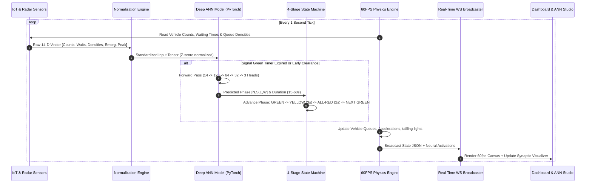
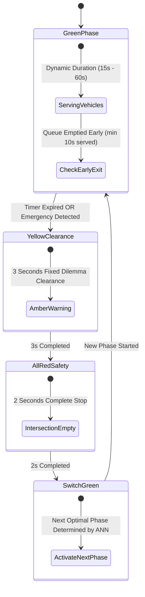

# System Architecture & Technical Workflow

## High-Level System Workflow Diagram

---

## 4-Stage Signal Phasing State Machine

---

## Core Components Summary

1. **`backend/ai/ann_model.py`:** PyTorch Multi-Task MLP architecture + NumPy reference engine.
2. **`backend/ai/dataset_generator.py`:** Webster delay minimization synthetic data generator.
3. **`backend/ai/ann_trainer.py`:** Training loop with Adam/SGD/RMSProp, loss curves, confusion matrix, and evaluation metrics.
4. **`backend/ai/ann_inference.py`:** Sub-2ms forward pass engine with input-gradient Explainable AI (XAI).
5. **`backend/simulation/engine.py`:** 4-stage signal controller with scenario injection and dual-benchmark counters.
6. **`frontend/src/components/JunctionCanvas.tsx`:** 60fps HTML5 Canvas traffic simulation with car physics and glowing 3-bulb signals.
7. **`frontend/src/pages/ANNStudioPage.tsx`:** Interactive neural network topology visualizer, training workbench, confusion matrix, and viva theory.
8. **`frontend/src/components/BenchmarkComparator.tsx`:** Real-time side-by-side benchmark comparison deck.
